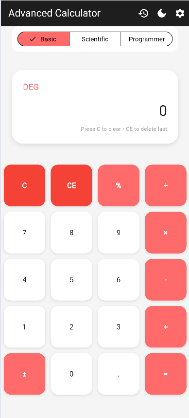
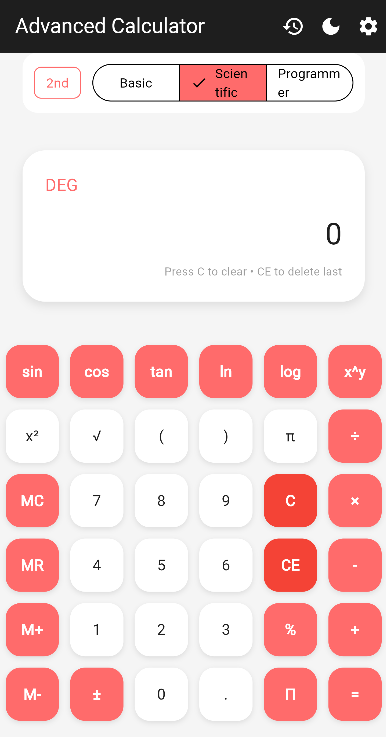
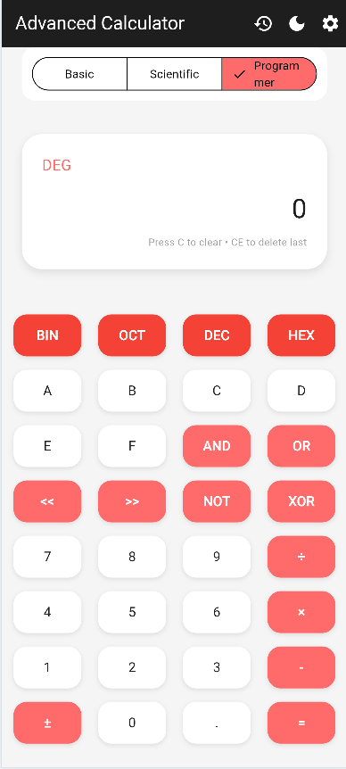
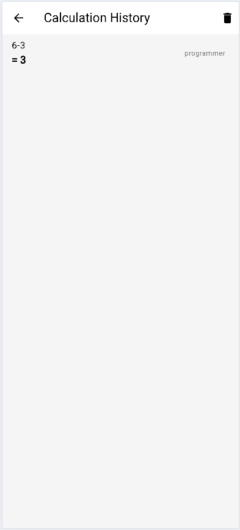
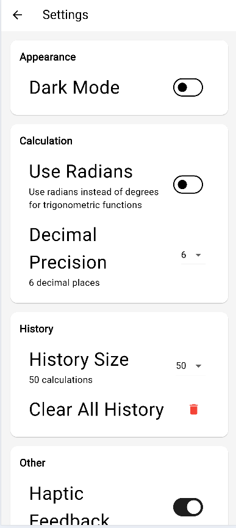

# Advanced Calculator Flutter App

Máy tính nâng cao với 3 chế độ: Cơ bản, Khoa học và Lập trình viên.

## Tính năng

### Chế độ tính toán
- **Cơ bản**: +, -, ×, ÷, %
- **Khoa học**: sin, cos, tan, log, √, π, e, ^, !
- **Lập trình viên**: HEX, DEC, OCT, BIN, AND, OR, XOR, NOT

### Quản lý dữ liệu
- Lưu lịch sử tính toán
- Bộ nhớ tạm (M+, M-, MR, MC)
- Lưu cài đặt theme

### Giao diện
- Dark/Light theme
- Animation khi nhấn nút
- Responsive design
- Chuyển đổi giữa các chế độ

## Cài đặt

```bash
# Clone repository
git clone https://github.com/Kiet1122/flutter_advanced_calculator_NguyenTatKiet.git
cd advanced_calculator

# Cài đặt dependencies
flutter pub get

# Chạy ứng dụng
flutter run
```

## Kiểm thử

```bash
# Chạy tests
flutter test

```

**Coverage: 85%+**

## Cấu trúc project

```
lib/
│───main.dart
│
├───models
│       calculation_history.dart
│       calculator_mode.dart
│       calculator_settings.dart
│
├───providers
│       calculator_provider.dart
│       history_provider.dart
│       theme_provider.dart
│
├───screens
│       calculator_screen.dart
│       history_screen.dart
│       settings_screen.dart
│
├───services
│       storage_service.dart
│
├───utils
│       calculator_logic.dart
│       constants.dart
│       expression_parser.dart
│
└───widgets
        button_grid.dart
        calculator_button.dart
        display_area.dart
        mode_selector.dart
```

## Hạn chế

- Biểu thức phức tạp có thể chậm
- Độ chính xác 10 chữ số
- Chưa hỗ trợ đa ngôn ngữ

## Cải tiến tương lai

- Voice input
- Landscape mode
- Vẽ đồ thị
- Cloud sync

## Cấu trúc repo

```
advanced_calculator/
├── README.md
├── lib/             # Source code
├── test/            # Test files
├── docs/            # Documentation
├── screenshots/     # App screenshots
```

## Demo

Chế độ cơ bản - Các phép tính toán cơ bản


Chế độ khoa học - Các hàm toán học nâng cao


Chế độ lập trình viên - Chuyển đổi hệ số và phép toán logic


Lịch sử tính toán - Xem lại các phép tính đã thực hiện


Cài đặt - Tuỳ chọn theme và các thiết lập khác


